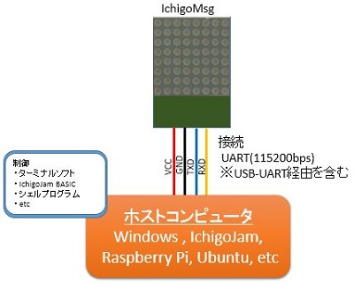
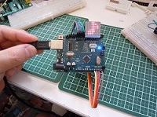
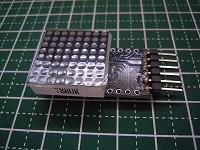
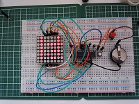
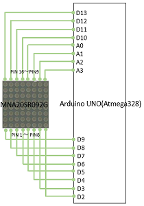
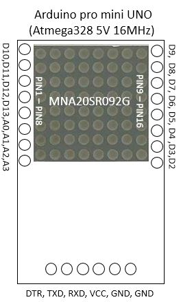
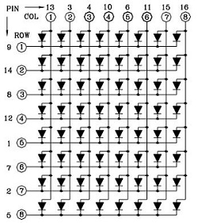

# IchigoMsg
  

動画 https://youtu.be/qJ0TjbGspZU

※IchigoMsgの使い方等については、IchigoMsg Wiki [「IchigoMsg利用に関する情報」](https://github.com/Tamakichi/IchigoMsg/wiki)にも記載しています.こちらも参照下さい.  

## 概要  
IchigoMsgはシリアル通信接続で8x8ドットマトリックスLED(単色)を制御するためモジュールです。  
### 特徴  
- テキスト形式のコマンド送信でメッセージ表示の制御ができます。  
- メッセージには日本語（教育漢字＋記号）が利用できます。
- IchigoJam1.2.1のフォントが利用できます。  
- ユーザーフォントの定義できます。  
- 少ない部品、配線にて製作できます。  

## システム構成  

### ハードウェア  
Arduino UNO、Arduino Pro mini等のATmega328搭載の互換機または、  
ATmega328単体(Arduinoブートローダ書き込み済み)を対象とします。  
クロックは16MHzを対象としていますが、8MHz(内部RCオシレータ)でも利用可能です。  

Arduino Uno|Arduino pro mini|atmega328
:--:|:--:|:--:|  
||  

### 回路図・結線
ドットマトリックスLEDの端子とArduinoの端子を直結するだけです。  
スケッチにて割り付けの定義が可能なため、ドットマトリックスLEDの端子に  
Arduinoの端子を自由に割り付けることが出来ます。  
  
   

### 必要部品一覧  
・Arduino Uno 、Arduino UNO、Arduino Pro mini等のATmega328搭載の互換機  
・8x8ドットマトリックスLED (アノードコモン、カソードコモンの両タイプに対応)  
・線材  
・USB-UARTモジュール(Arduino Pro mini,ATmega328単体利用時)  

### 開発環境  
Arduino IDE 1.6.X   

### スケッチ(プログラムソース)   
プログラムソースはフォルダ ichigoMsg/ 格納してます。  
各自の開発環境に配置してArduino IDEにてロードして下さい。  
下記のライブラリを利用していますので、入手して利用可能な状態にして下さい。  
 **TimerOne http://playground.arduino.cc/Code/Timer1**

使用する8x8ドットマトリックスLEDのピン割り付け仕様、タイプ(アノードコモン、カソードコモン) に  
対応するために、スケッチの次の箇所を修正して下さい。  

**IchigoMsg.ino**   
    
    #define LED_TYPE LED_CATHODE // row側LEDタイプ(LED_ANODE or LED_CATHODE)
    uint8_t col[8] = {6,  12, 13,  3, A1,  4,  8,  9};  // COL 1-8 へのArduino 割り付けピン定義
    uint8_t row[8] = {2,   7, A3,  5, 10, A2, 11, A0};  // ROW 1-8 へのArduino 割り付けピン定義

LED_TYPEには使用するドットマトリックスLEDのROW側のタイプ(アノードorカソード)を定義します。  
  
上図では、ROWに接続するLEDの端子がカソードのですので**LED_TYPE**には**LED_CATHODE**を定義します。  

またCOL1～8、ROW1～8に繋げるArduinoの端子番号をを配列**col**,**row**に定義します。  

## 使い方  

### IcigoMsgと接続する        
<通信条件>  
 - 通信速度 115200bps  
 - データ長 8ビット
 - パリティ なし  
 - ストップビット 1  

### コマンドを送信して制御する  
<通信プロトコル使用>  
- ホストからのコマンド送信  
  - 形式  
   **@コマンド名 引数 [,引数] 改行**  
   ※ 改行は **CR+LF** or **CR** or **LF** の形式が可能  

  - 応答  
   正常： **OK** 改行  
   異常： **NG** 改行  
    
  ※ 改行は **CR+LF** 
  応答とは別にデータを出力するコマンドあり。

 
### 利用可能なコマンド   

利用可能なコマンドに関しては、IchigoMsg Wiki [IchigoMsg利用に関する情報](https://github.com/Tamakichi/IchigoMsg/wiki)にて詳細を解説しています.  

|コマンド名称|記述形式|説明|
|:--|:--|:--|
|メッセージ登録|@setmsg  __メッセージ番号__, __メッセージ文__|メッセージ番号(0～7)にメッセージ文を登録する|  
|メッセージ追記|@setmsga __メッセージ番号__, __メッセージ文__|メッセージ番号(0～7)にメッセージ文を追記登録する| 
|メッセージ確認|@getmsg __[メッセージ番号]__|指定してたメッセージ番号(0～7,省略時は全件)のメッセージ文の内容を出力する|  
| メッセージ削除|@delmsg __メッセージ番号__|メッセージ番号(0～7)のメッセージ文を削除する| 
|メッセージ出力       |@print __メッセージ文__|指定したメッセージ文を直接表示する|    
|メッセージ出力|@? __メッセージ文__ |@printの短縮系.指定したメッセージ文を直接表示する|  
|表示の消去           |@cls|表示内容を消去する.
|再生メッセージリスト設定|@setlist __メッセージ番号[メッセージ番号][メッセージ番号]...__| 最大8個まで指定可能 | 
|再生|@play __プレイモード__| プレイモード 0:停止 1:順次再生(1回のみ) 2:順次再生(繰り返し) 3:ランダム再生(繰り返し) |
|再生停止	|@stop | 自動再生を停止する| 
|フォントの登録 |@setfont __フォント番号__, __フォント定義__|フォント番号:0～23, フォント定義:16桁16進数 8バイト分|  
|フォントの確認 |@getfont __[フォント番号]__| 指定したフォント番号0～23(省略時は全件)の内容を出力する| 
|フォントデータ直接表示 |  @out __フォント定義__| フォント定義: 16桁16進数 8バイト分| 
|変数値設定	|@setvalue __変数番号__, __設定値__|変数番号:0～9,設定値: 文字列16バイト迄|  
|変数の値確認  	|@getvalue __[変数番号]__ |で指定した変数番号0～9(省略時は全件)の内容を出力する|
|スクロール動作の設定  |@scrl __+\|-\|動作__, __速度__ |動作 相対+-(45°増減)or 0～15(デフォルト5), 速度0～32767(デフォルト60)| 
|メッセージ間ウエイト設定  |@mwait	__間隔__ |間隔 0～32767 msec デフォルトは0|   
|文字間ウェイト設定  |@cwait	__間隔__ |間隔 0～32767 msec デフォルトは0|   
|文字の回転補正  |@rotate	__+ \|- \| 向き__ | 相対指定+-(増減90度) or 向き 反時計 0:0度 1:90度 2:180度 3:270度(デフォルト)|  
|文字コード系設定  |@setcode __コード系__|コード系 0:UTF-8 1:IchigoJam ascii(デフォルト)|  
|実行結果出力設定  |@setout	__モード__| モード 0 通常出力 1 IchigoJam用に先頭に'を付加 2(デフォルト):出力なし|    
|起動時ロゴ表示設定  |@logo __[モード]__| モード0 表示なし, 1 表示あり(デフォルト) 、省略時は起動時ロゴ表示) |
|設定値保存|@save| 現在の設定値をEEPROMに保存する| 
|設定値読込|@load | 設定値をEEPROMから読み込む|
|デフォルト値読込|@default|設定値をデフォルトに戻す|  
|EEPROM初期化|@clsrom|EEPROMを初期化する|

### メッセージ文に埋め込んで使えるコマンド(埋め込みコマンド)  

利用可能な埋め込みコマンドに関しては、IchigoMsg Wiki [IchigoMsg利用に関する情報](https://github.com/Tamakichi/IchigoMsg/wiki)にて詳細を解説しています.  

|機能名|コマンド|説明|
|:--|:--|:--|:--|
|登録フォント挿入|			{fフォント番号}|フォント番号(0～23)で指定したフォントを挿入表示する|
|指定フォントパターン挿入|	{oフォント定義}|フォント定義(16桁16進数 8バイト分8x8ドット)を挿入表示する|
|utf16コード指定フォント挿入|	{u4文字コード}|文字コード(4桁16進数)に該当するフォントを挿入表示する|
|IchigoJamフォント挿入|		{a文字コード}|文字コード(0～255)に該当するIchigoJamフォントを挿入表示する|
|登録メッセージ挿入|		{mメッセージ番号}|メッセージ番号(0～7)で指定したメッセージ文を挿入表示する|
|変数値挿入|				{v変数番号}|変数番号(0～9)で指定した変数の内容を挿入表示する|
|半角2文字挿入|				{h文字1文字2}|文字1文字2(0x20～0x7dの範囲の文字)2文字を表示する|
|ドット表示|				{横座標 縦座標 ドット} |横座標(0～7)縦座標(0～7)にドット(0or1)を表示する.例:{121}|
|表示の消去|					{}|現在の表示を消去する|
|スクロール動作設定|		{s+\|-\|動作コード}|動作指定. 相対45度づつ増減:+-、or 動作コード(0～15 デフォルト5)|
|スクロール速度設定|		{tウェイト}|1ドットあたりのウェイト(0～32767msec デフォルトは 60)を指定する|
|即時ウェイト|				{dウエイト時間}|指定したウェイト(0～32767msec)を行う|
|1ドットスクロール|			{>[動作コード}|指定した動作コード(0～15 デフォルトは5)]で1ドットスクロールを行う|
|メッセージ間ウエイト設定|	{w間隔}|メッセージ文間のウェイト(0～32767 msec デフォルト0)を指定する|
|文字間ウェイト設定|			{c間隔}|以降のメッセージ文の文字間隔(0～32767 msec デフォルト0)を設定する|
|文字の回転補正|				{r+\|-\|向き}|以降のメッセージ文の回転補正(0～3 デフォルト3)を行う|
|IchigoJamコード系利用|	{i}|以降のメッセージ文をIchigoJam asciiとして扱う|
|utf8コード系利用|				{n}|以降のメッセージ文をutf8コードとして扱う|
|設定値読込|	{!}|EEPROMデータをロードして設定を初期化する|

## 利用例  
### Windowsからの利用  
IchigoMsg Wikiの[「1.基本」](https://github.com/Tamakichi/IchigoMsg/wiki/1.-%E5%9F%BA%E6%9C%AC)を参照して下さい. スケッチのコンパイルから基本操作について解説しています.   

### IchigoJamからの利用  
IchigoMsg Wikiの[「2.2. IchigoJamから利用する」](https://github.com/Tamakichi/IchigoMsg/wiki/2.2.-IchigoJam%E3%81%8B%E3%82%89%E5%88%A9%E7%94%A8%E3%81%99%E3%82%8B)を参照して下さい.

## ライセンス    
  [CC BY](https://creativecommons.org/licenses/by/4.0/) [IchigoJam](http://ichigojam.net/) / [Tamakichi-San](https://github.com/Tamakichi)

本 プログラムのフォントデータの一部に IchigoJam 1.2.1 のフォントデータを使用しています。  
IchigoJam のフォントが [CC BY](https://creativecommons.org/licenses/by/4.0/) ライセンスを明示しています。（[CC BY](https://creativecommons.org/licenses/by/4.0/) [IchigoJam](http://ichigojam.net/))  
そのため、本プログラムもこのライセンスを継承し、[CC BY](https://creativecommons.org/licenses/by/4.0/)で公開いたします。  
営利目的も含めて自由にご利用いただけますが（書籍などでのご利用も構いません）、  
ライセンスを含めた著作表記は「[CC BY](https://creativecommons.org/licenses/by/4.0/) [IchigoJam](http://ichigojam.net/) / [Tamakichi-San](https://github.com/Tamakichi)」です。  
紙面など URL をリンクできない場合は、リンクを URL 表記にして下さい。  
「CC BY IchigoJam http://ichigojam.net/ Tamakichi-San https://github.com/Tamakichi」  
