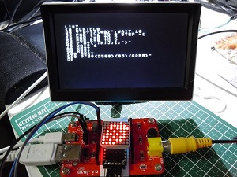

# IchigoMsg
  

## 概要  
シリアル通信経由で表示内容の制御が簡単に行えるLEDドットマトリックスモジュールです。  

## <ライセンスにおける注意事項>  
  [CC BY](https://creativecommons.org/licenses/by/4.0/) [IchigoJam](http://ichigojam.net/) / [Tamakichi-San](https://github.com/Tamakichi)

本 プログラムのフォントデータの一部に IchigoJam 1.2.1 のフォントデータを使用しています。  
IchigoJam のフォントが [CC BY](https://creativecommons.org/licenses/by/4.0/) ライセンスを明示しています。（[CC BY](https://creativecommons.org/licenses/by/4.0/) [IchigoJam](http://ichigojam.net/))  
そのため、本プログラムもこのライセンスを継承し、[CC BY](https://creativecommons.org/licenses/by/4.0/)で公開いたします。  
営利目的も含めて自由にご利用いただけますが（書籍などでのご利用も構いません）、  
ライセンスを含めた著作表記は「[CC BY](https://creativecommons.org/licenses/by/4.0/) [IchigoJam](http://ichigojam.net/) / [Tamakichi-San](https://github.com/Tamakichi)」です。  
紙面など URL をリンクできない場合は、リンクを URL 表記にして下さい。  
「CC BY IchigoJam http://ichigojam.net/ Tamakichi-San https://github.com/Tamakichi」  
